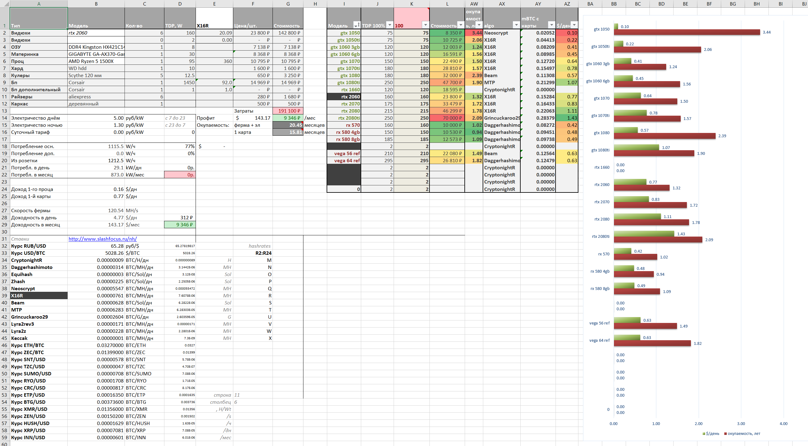

# nicehash-calc
Nicehash Mining Profit Calculator

Таблица Excel, рассчитывающая показатели доходности от сдачи в аренду майнингового оборудования через сервис Nicehash.

Для обновления курсов криптовалют и цен на вычислительные мощности нужно:
1. Открыть файл index.php (на веб-сервере с php-интерпретатором), либо перейти на [эту страницу](http://www.slashfocus.ru/nh/).
2. Скопировать данные со страницы в ячейки D32:D59

Цены на оборудование пока подставляются руками с Яндекс.Маркета

Для расчета потребления электричества необходимо:
1. Переключить параметр в ячейке D16 в значение 1.
2. В ячейках B14 и B15 указать дневную и ночную стоимость электричества в вашем регионе.
